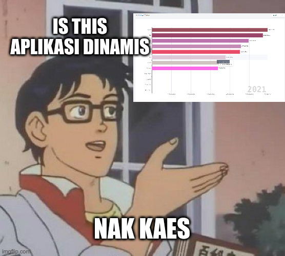

## Dashboard Dinamis




Ntah lah, ini cuma iseng doang. Kalo mau pake, tolong di fork jangan di clone terus upload di repo sendiri, kasih creddit lah wwkwkwk. Sebelum mulai, copy `.env.example` jadi `.env`, edit dikit yang perlu. Untuk database memang pake sqlite jadi bukan pake `mysql`. Untuk pakenya tinggal jalankan aja kayak project laravel biasa.Untuk pakenya tinggal jalankan aja kayak project laravel biasa.

```bash
composer install
```

Buat file text `database.sqlite` di folder `database`. Terus jalankan

```bash
php artisan migrate
php artisan db:seed
```

Jalankan project

```bash
php artisan serve
```

Untuk data, sumbernya dari file `database/data.csv`. Data terdiri dari data import migas, non migas, total, bulan + tahun provinsi Jawa Timur dari tahun 2007 sampe Agustus 2021, sumber data dari BI PI ES Jatim. Kalo mau edit sesuaikan migration, seeder, model, tabel, dan lain sebagainya. Untuk laravel nya disini pakenya yang livewire nya, because I am too lazy.

> CUKUP SAMPE DISINI KEGABUTANNKU